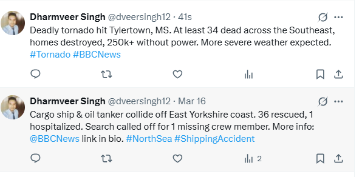

# 🌟 Instagram to X Integration System

      

 


Seamlessly integrate Instagram with X (Twitter) using AI-powered summarization and FastAPI.  

---

## 🚀 Features
✅ Fetch latest Instagram posts via **RapidAPI**  
✅ AI-powered caption summarization using **Google Gemini**  
✅ Post summaries directly to **X (Twitter)**  
✅ REST API endpoints for integration  
✅ Docker containerization for easy deployment  
✅ Comprehensive error handling  
✅ Logging to `app.log`  

---

## 🏗️ System Architecture
```plaintext
┌──────────────────────────────┐
│          Client              │
│ (API Consumer/Browser)       │
└──────────────┬───────────────┘
               │
               │ HTTP Requests
               ▼
┌──────────────────────────────┐
│       FastAPI Server         │
│ ┌──────────────────────────┐ │
│ │   Endpoints:             │ │
│ │  • /latest-post (GET)    │ │
│ │  • /summarize (POST)     │ │
│ │  • /post-tweet (POST)    │ │
│ └─────────────┬────────────┘ │
└───────────────┼──────────────┘
                │
                │ Service Calls
┌───────────────┴──────────────┐
│        External APIs         │
│                              │
│ ┌────────────┐ ┌───────────┐ │
│ │ Instagram  │ │ Google    │ │
│ │ (RapidAPI) │ │ Gemini AI │ │
│ └─────┬──────┘ └─────┬─────┘ │
│       │               │       │
│ ┌─────▼──────┐ ┌──────▼─────┐ │
│ │   X.com    │ │ Summarized │ │
│ │ (Twitter)  │ │  Content   │ │
│ └────────────┘ └────────────┘ │
└───────────────────────────────┘
```

### 📌 **Component Flow**
🔹 **Instagram Client** – Fetches posts via RapidAPI  
🔹 **FastAPI Server** – Handles requests and processes data  
🔹 **/summarize** – Cleans text and generates summaries  
🔹 **/post-tweet** – Publishes summaries to X.com  
🔹 **Google Gemini** – Processes text via LLM  
🔹 **X Client** – Handles Twitter API interactions  

---

## 🛠️ Setup
### ✅ **Prerequisites**
- Python **3.11+**  
- Docker (optional)  
- API Keys:
  - **RapidAPI** – Instagram API  
  - **Google Gemini**  
  - **X Developer Portal**  

### ✅ **Clone the Repository**
```bash
git clone https://github.com/yourusername/instagram-x-integration.git
cd instagram-x-integration
```

---

## 🔑 Configuration
Create a `.env` file in the root directory:

```bash
# Required
RAPIDAPI_KEY="your_rapidapi_key"
GEMINI_KEY="your_gemini_key"
X_API_KEY="your_x_api_key"
X_API_SECRET="your_x_api_secret"
X_ACCESS_TOKEN="your_x_access_token"
X_ACCESS_SECRET="your_x_access_secret"

# Optional
INSTAGRAM_USERNAME="bbcnews"
LOG_LEVEL="INFO"
```

---

## 🌐 API Documentation
### **Endpoints**
| Endpoint         | Method | Description                          | Parameters         |
|------------------|--------|--------------------------------------|--------------------|
| `/latest-post`   | `GET`  | Fetch latest Instagram post          | -                  |
| `/summarize`     | `POST` | Generate AI summary                  | `text`, `max_length` |
| `/post-tweet`    | `POST` | Publish summary to X (Twitter)       | `text`             |

---

### 🔍 **Example Request**
```bash
curl -X POST "http://localhost:8000/summarize" \
-H "Content-Type: application/json" \
-d '{"text": "Your long caption...", "max_length": 250}'
```

### ✅ **Example Response**
```json
{
  "status": "success",
  "original_length": 450,
  "summary_length": 248,
  "summary": "Tornado strikes Mississippi..."
}
```

---

## 🚢 Deployment
### 🐳 **Using Docker**
1. **Build Docker Image**  
```bash
docker build -t insta-x .
```
2. **Run the Container**  
```bash
docker run -p 8000:8000 --env-file .env insta-x
```

---

### 🚀 **Manual Deployment**
1. **Create Virtual Environment**  
```bash
python -m venv venv
source venv/bin/activate
```
2. **Install Dependencies**  
```bash
pip install -r requirements.txt
```
3. **Start Server**  
```bash
uvicorn app.api:app --reload
```

---

## 🧪 Testing
### ✅ **Run Unit Tests**
```bash
pytest tests/ -v
```
### ✅ **Verify API Endpoints**
- Open API Docs → [http://localhost:8000/docs](http://localhost:8000/docs)  
- Check Swagger UI  

---

## 📊 Monitoring
✅ **Logs**  
```bash
tail -f app.log
```

✅ **API Metrics**  
- Available at `/docs` endpoint  

---

## 📝 License
This project is licensed under the **MIT License**.  

---


